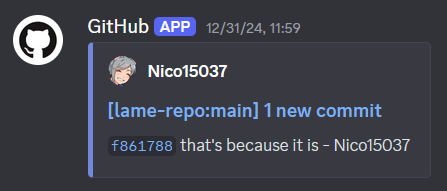
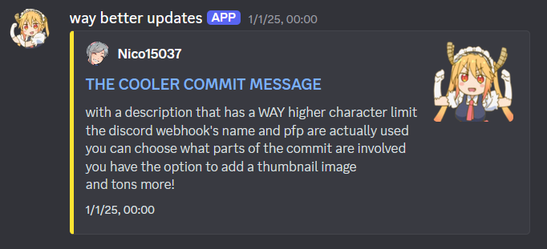

<div align="center">


</div>

### Ever thought the basic Github webhook in Discord is lame?
  
### After around 50 characters, it shortens the rest of the commit description to `...` <br> Nothing about it can be customized. Even your webhook settings in Discord are overwritten!
### BUT IT DON'T GOTTA BE LIKE THAT  
  
## Make your commits actually nice to look at with this tutorial!


1. [Discord Setup](#discord-setup)
2. [Github Setup](#github-setup)
3. [Making the Embed](#making-the-embed)
4. [Workflow File](#workflow-file)
- [Troubleshooting](#troubleshooting)
- [Credits](#credits)
- [Extra details + Ways you can help contribute](#extra-infocries-for-help)

TL;DR:
1. Make a discord webhook for the channel you want updates in
2. Copy this repo's `.github/workflow` folder into the root folder of your repo
3. Anything that says "secrets" make a github secret for
4. finished 2easy uwin

------------------------------
# Discord Setup

1. Server Settings -> Integrations -> Webhooks
2. Click `New Webhook`
3. Edit the picture, name, and choose the channel where it'll send the embed  
This what will show up in discord as the ["user"](#webhook-user-profile)
4. Click `Copy Webhook URL` - you'll need this for the next part

------------------------------
# Github Setup

1. Your repo -> Settings -> Secrets and variables -> Actions
2. Click `New repository secret`
3. For the `Name`, put `DISCORD_WEBHOOK`
4. For the `Secret`, paste in your webhook URL
5. Click `Add secret`  
You should now see it in your list, like the example below:  


> [!TIP]
You can also make the webhook color and image link [(I recommend using a CDN)](#embed-thumbnail) into a secret!  
Doing this means you can copy-paste the same `discord-webhook.yml` file everywhere, and all "settings" will contained inside each individual repository's secrets. Or you can stick to keeping those inside the workflow file.  
Up to personal preference on how you wanna manage things!

------------------------------
# Making the Embed
- [Discord Variables](#discord-variables)
- [Github Variables](#github-variables)

## Discord Variables
1. Use this [embed maker](https://discohook.org) or whatever you prefer  
↓ If using the embed maker ↓
2. Go to `JSON Data Editor` at the bottom
3. Go to the `"embeds"` section, and copy the contents inside the brackets `[ ]`

Here's an example of what you should have:
```json
{
  "title": "titleful",
  "description": "descriptive",
  "color": 16766720
}
```

When you've made it, paste it into [JSONLint](https://jsonlint.com) and click `Validate JSON`  
This will also make it a bit more human-readable like the example above

> [!NOTE]
The end-result color code is not a normal hex code (even if your editor showed otherwise!)  
This is because JSON does not support hexadecimal, so it has to be stored as a decimal  
\- so you may need to convert it to decimal if you're directly editing the embed.

## Github Variables
###### Customizing the embed based on the commit (the cool part)

List of variables (well, at least [the ones I know of](#more-variables)):
```yaml
commit.url
commit.title
commit.description
commit.timestamp
commit.author.name
commit.author.username
```

Example of how to use them:
```yaml
{
  "title": "{{ commit.title }}",
  "description": "{{ commit.author.username }} pushed this at {{ commit.timestamp }}. Check out how they {{ commit.description }}",
  "color": 16766720
}
```

------------------------------
# Workflow File

1. Make a `.github` folder in your repository's root folder
2. Make a `workflows` folder inside `.github`
3. Now in `.github/workflows`, make a `discord-webhook.yml` file

## Editing `discord-webhook.yml`

Paste this in:

```yaml
name: Discord Webhook Workflow
on:
  push:
    branches: [ main ]

jobs:
  postcommitmessage:
    runs-on: ubuntu-latest
    steps:
      - name: Discord Commits
        uses: Sniddl/discord-commits@v1.3
        with:
          webhook: ${{ secrets.DISCORD_WEBHOOK }}
          embed: '{}'
```

- `branches` - Lists out the branches that will trigger a discord message sending when a commit is pushed to one of them
- `webhook` - Uses the github repo's secret that has your discord webhook in it
- `embed` - Your embed. Make sure you have the apostrophes `' '` around the braces `{ }` or it won't work.

I recommend just copying the [file from this repository](.github/workflows/discord-webhook.yml) and editing that.  
By default, it uses the "improved" embed from the [image](#but-it-dont-gotta-be-like-that) at beginning of this tutorial.

------------------------------
# Troubleshooting
###### aka oh my god what the fuck did I do wrong

- In your `discord-webhook.yml` file, make sure there are no tabs, only spaces  
.yaml files are whitespace-sensitive and don't allow tabs
- Paste your embed in [JSONLint](https://jsonlint.com) and click `Validate JSON`
- Check the embed is wrapped in apostrophes `' '`, like so: `embed: '{ }'`
- Check the embed has the right color format (decimal, not hex)
- Make sure the `on: push: branches: [branch_name]` is set to the right branch (main/master/whatever it is for you)
- Make sure the github secret has the right webhook URL  
Unfortunately you can't actually see what it previously was, so just paste it in again and click `Update secret`
- Still struggling? Compare your `discord-webhook.yml` against the [one in this repository](.github/workflows/discord-webhook.yml)

If all else fails, restart this tutorial from the top ¯\\(o_o)/¯

------------------------------
# Credits

https://github.com/WolfNT90  
he showed me this and made a little tutorial (thank you)  
deleted it the server it was in (unfortunate)    
but hey I still refigured it out and made this new tutorial (yippee)

https://github.com/Sniddl + everyone who worked on this  
they actually made the workflow action  
this repository I made is basically just an example + step-by-step guide for people who don't know any of this

https://github.com/Nico15037  
holy shit that's me

------------------------------
# EXTRA INFO/CRIES FOR HELP

If you know how to help with any of these, make a pull request or reach out to me at [@nico15037](https://discord.com/users/288088083675742208) on discord!

### more variables
gamers I gotta be real with you I don't know where to find an actual list of these  
I literally brute forced it and made the embed print the entire payload with all variables so I could find what I want  
and that was I think years ago by now so I can't find where I dumped it or even remember how to do it  
I think you just make the desc {{ commit }} {{ github.context.payload }}? but .slice it or something bc it's fucking MASSIVE  
future nico: OK I JUST TRIED THAT AND YEAH NO IDK HOW I DID IT. GOOD LUCK GUYS.

### webhook "user profile"
These all DO matter and are basically the "profile" of the "person" posting  
and unfortunately I can't find a way to just do it in the workflow file so everything's in one place  
(like how the [lame default github webhook](#ever-thought-the-basic-github-webhook-in-discord-is-lame) presumably does it)

### embed thumbnail
I'm unable to find a way to use a file in the repository itself for the embed thumbnail  
but I also just don't know a lot about github workflows, so if anyone DOES figure it out hmu PLEASE  
I ended up just using [Cloudinary](https://cloudinary.com) as my image host cause it's free (not sponsored)  
cloudinary tip make sure to turn off `Include the version number in the delivery URL` when copying the URL so you can always update it without breaking your commit messages in discord

### using a newer version
This uses [Sniddl/discord-commits@v1.3](https://github.com/Sniddl/discord-commits/releases/tag/v1.3)  
because any versions past that make it add "Successful Commit to `user/repository-name`" and I don't how to turn it off lol